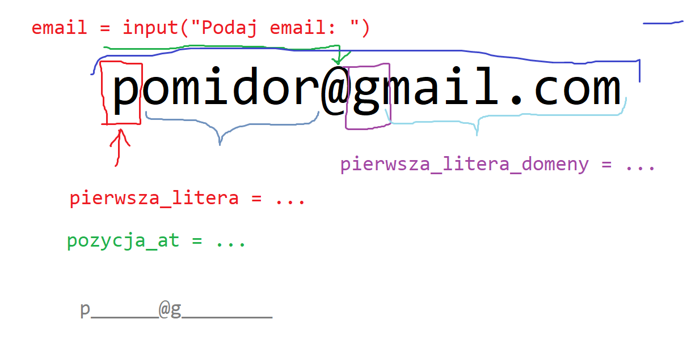

Napisać program, który:

* zapyta użytkownika o adres email
* "ocenzuruje" adres email, tzw. przykładowy adres: `m.adamowski@alx.pl` zamieni na `m__________@a_____` (liczba podkreśleń musi się zgadzać)

## Podpowiedź

